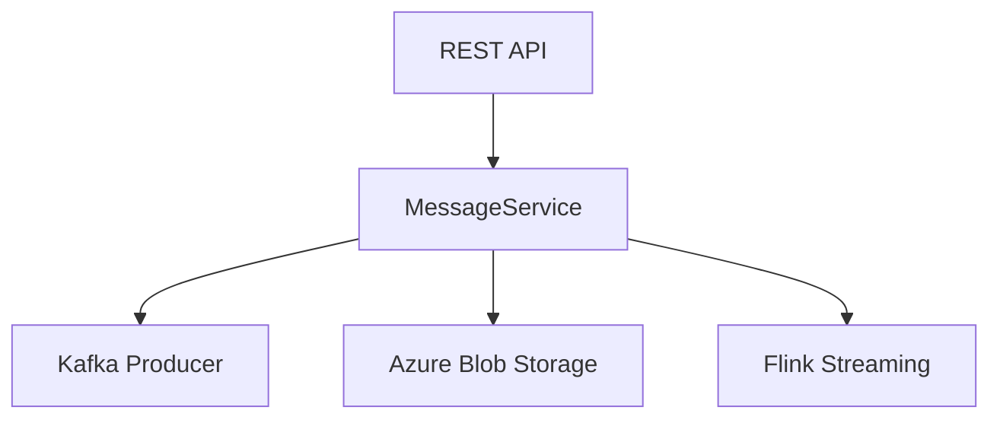

# serbathome-eventhub-demo-producer
A demo producer for Azure Event Hub using Kafka and Flink, built with Quarkus.

## Overview
This project demonstrates sending messages to Azure Event Hub via Kafka, optionally using Apache Flink for streaming, and storing large payloads in Azure Blob Storage. It solves the problem of efficiently handling and streaming large messages to Event Hub, with support for external payload storage.

## Features
- REST API for sending messages to Event Hub
- Supports large payloads via Azure Blob Storage
- Optional Flink streaming integration
- Configurable message count and payload size
- Built with Quarkus for fast startup and cloud-native deployment

## Architecture
The application exposes a REST endpoint to send messages. Large payloads are uploaded to Azure Blob Storage, and message metadata is sent to Event Hub via Kafka. Flink can be used for streaming if enabled.



## Technology Stack
- Java 17
- Quarkus 3.8.1
- Apache Kafka
- Apache Flink 1.16.0
- Azure Blob Storage
- Maven
- Docker

## Prerequisites
- Java 17 runtime
- Maven 3.9+
- Docker (for containerization)
- Access to Azure Event Hub and Blob Storage
- Kafka broker (Azure Event Hub SASL/SSL)

## Installation
```bash
git clone <repository-url>
cd serbathome-eventhub-demo-producer
mvn package -DskipTests
```

## Configuration
Configure the following properties in `src/main/resources/application.properties`:

```
kafka.bootstrap.servers=<eventhub-namespace>:9093
kafka.client.id=<client-id>
kafka.security.protocol=SASL_SSL
kafka.sasl.mechanism=PLAIN
kafka.sasl.jaas.config=<SASL config>
kafka.topic=<topic>
azure.storage.connection-string=<Azure Blob Storage connection string>
azure.storage.container-name=<container name>
```

Secrets can be managed via Kubernetes secrets as shown in `deployment.yaml`.

## Usage
Run the application (standalone or in Docker):

```bash
java -jar target/quarkus-app/quarkus-run.jar
```

Send messages via REST API:

```bash
curl -X POST http://localhost:8080/api/messages/send \
  -H "Content-Type: application/json" \
  -d '{"messageCount": 10, "externalPayload": true, "useFlink": false, "payloadSize": 500000}'
```

## Development
- Build: `mvn package`
- Run: `java -jar target/quarkus-app/quarkus-run.jar`
- Test: `TODO: Add test instructions`
- Lint/Format: `TODO: Add linting instructions`

## Project Structure
```
/src/main/java/com/example/app    # Application source code
/src/main/resources              # Configuration files
/Dockerfile                      # Container build
/deployment.yaml                 # Kubernetes deployment
/pom.xml                         # Maven build config
```

## Troubleshooting
- Ensure all configuration values are set correctly.
- Check Event Hub and Blob Storage connectivity.
- Review logs for errors (`quarkus.log.level` in application.properties).
- TODO: Add more troubleshooting steps

## Contributing
- Use feature branches for new work
- Submit pull requests for review
- Follow code review and commit guidelines
- TODO: Add detailed contribution workflow

## License
TODO: Specify project license
