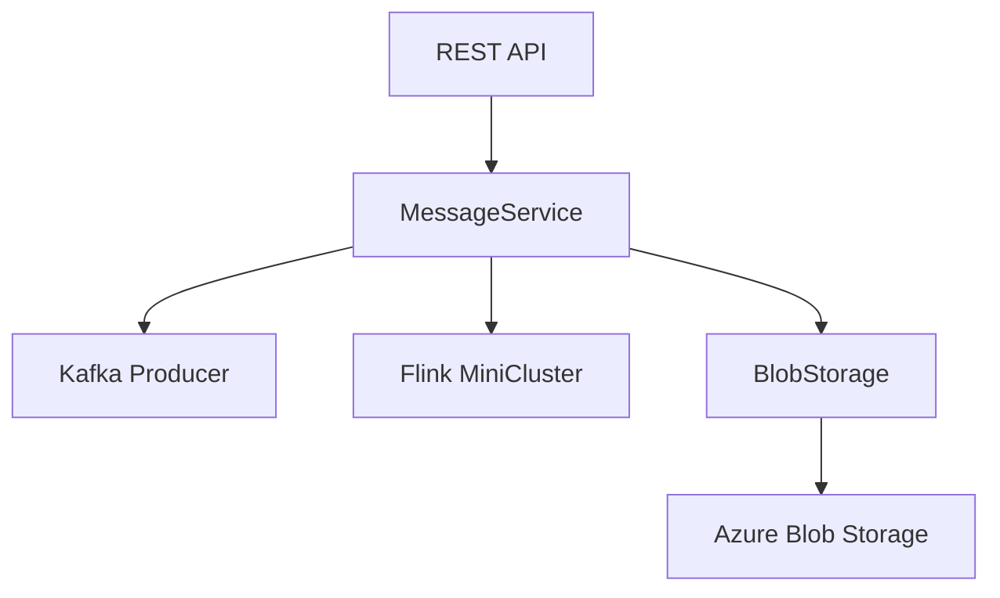

# serbathome-eventhub-demo-producer

A demo producer for Azure EventHub using Kafka and Flink, built with Quarkus.

## Overview

This project demonstrates sending messages to Azure EventHub via Kafka and Apache Flink, supporting both inline and external payloads. It solves the problem of scalable message production and payload management for EventHub integration scenarios. The application exposes a REST API for message production, optionally storing large payloads in Azure Blob Storage.

## Features

- REST API for sending messages to EventHub
- Supports inline and external (blob) payloads
- Option to use Apache Flink or Kafka Producer for message delivery
- Asynchronous blob upload for external payloads
- Configurable message count and payload size
- Kubernetes deployment manifests
- Docker support

## Architecture

The application consists of:
- **REST API**: Exposes endpoints for message production
- **MessageService**: Handles message creation and delivery via Kafka or Flink
- **BlobStorage**: Manages payload storage in Azure Blob Storage
- **Config**: Centralizes configuration for Kafka, Azure, and Flink



## Technology Stack

- Java 17
- Quarkus 3.8.1
- Apache Flink 1.16.0
- Apache Kafka 3.6.0
- Azure SDK (Blob Storage, Identity)
- Maven
- Docker
- Kubernetes

## Prerequisites

- Java 17 runtime
- Maven 3.9+
- Docker (for container builds)
- Access to Azure Blob Storage
- Azure EventHub with Kafka endpoint
- Kubernetes cluster (optional, for deployment)

## Installation

```bash
git clone <repository-url>
cd serbathome-eventhub-demo-producer
mvn package -DskipTests
```

To build the Docker image:

```bash
docker build -t eventhub-kafka-producer .
```

## Configuration

Configuration is managed via environment variables or application properties. Required settings:

- `kafka.bootstrap.servers`: Kafka broker address
- `kafka.client.id`: Kafka client ID
- `kafka.security.protocol`: Security protocol
- `kafka.sasl.mechanism`: SASL mechanism
- `kafka.sasl.jaas.config`: SASL JAAS config
- `kafka.topic`: Target EventHub topic
- `azure.storage.connection-string`: Azure Blob Storage connection string
- `azure.storage.container-name`: Blob container name

Example Kubernetes secret:

```yaml
apiVersion: v1
kind: Secret
metadata:
  name: eventhub-kafka-producer-secrets
stringData:
  KAFKA_SASL_JAAS_CONFIG: <your-jaas-config>
  AZURE_STORAGE_CONNECTION_STRING: <your-connection-string>
```

## Usage

Run locally:

```bash
java -jar target/quarkus-app/quarkus-run.jar
```

Send messages via REST API:

```bash
curl -X POST http://localhost:8080/api/messages/send \
  -H "Content-Type: application/json" \
  -d '{"messageCount": 10, "externalPayload": true, "useFlink": false, "payloadSize": 500000}'
```

## Development

- Build: `mvn package`
- Run: `mvn quarkus:dev`
- Test: TODO: Add test instructions
- Linting/formatting: TODO: Add linting instructions

## Project Structure

```
/src/main/java/com/example/app
    BlobStorage.java      # Azure Blob Storage integration
    Config.java           # Application configuration
    MessageController.java# REST API controller
    MessageService.java   # Message production logic
/src/main/resources       # Application properties
Dockerfile                # Container build
pom.xml                   # Maven build file
deployment.yaml           # Kubernetes manifests
```

## Troubleshooting

- Ensure all configuration values are set correctly
- Check Azure and Kafka connectivity
- Review logs for Flink MiniCluster startup issues
- TODO: Add more troubleshooting tips

## Contributing

- Use feature branches for new work
- Submit pull requests for review
- Follow code review and commit guidelines
- TODO: Add detailed contributing workflow

## License

TODO: Add license.
